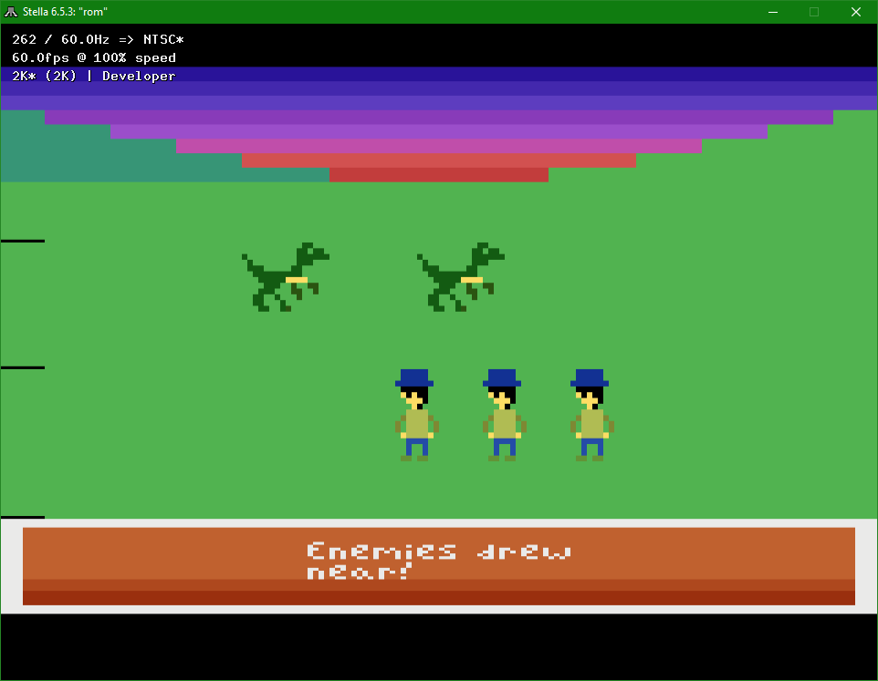

# VCS-RPG
A basic demonstration of what RPG-like graphics could look like on an Atari 2600. Inspired by a [post](https://www.reddit.com/r/Atari2600/comments/pest3d/how_i_wish_we_had_a_turnbased_rpg_for_the_atari/) on [r/Atari2600](https://www.reddit.com/r/Atari2600/) by [u/SuperAssumption](https://www.reddit.com/user/SuperAssumption/).

